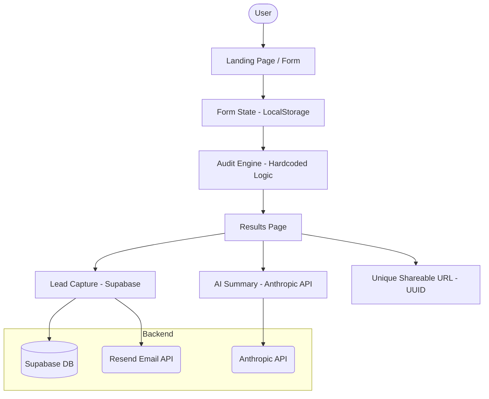

# ARCHITECTURE.md

## System Diagram

## Data Flow

1. **Input Collection**: User enters AI tool usage in a multi-step or single-page form. Data is persisted in `localStorage` to prevent loss on refresh.
2. **Analysis**: The `AuditEngine` (client-side or server-side utility) compares input against `PRICING_DATA.md` logic.
3. **Persistance**: Upon viewing results, an audit record is created in Supabase with a unique ID.
4. **Summary**: The results are sent to an Edge Function/API Route that calls Anthropic's Claude 3.5 Sonnet to generate a human-readable summary.
5. **Lead Gen**: If the user submits their email, the Supabase record is updated, and a confirmation email is triggered via Resend.
6. **Viral Loop**: The user can share their unique audit URL. The public view strips PII but retains the audit insights.

## Technology Stack

- **Frontend**: Next.js 14 (App Router), TypeScript, Tailwind CSS, shadcn/ui.
- **Backend**: Supabase (Database, Auth-free storage).
- **Email**: Resend.
- **AI**: Anthropic Claude 3.5 Sonnet.
- **Deployment**: Vercel.

## Scaling to 10,000 audits/day

To handle high volume:
- **Caching**: Implement aggressive caching for the Audit Engine logic.
- **Queueing**: Move email sending and AI summary generation to background jobs (Vercel KV or Upstash QStash).
- **Rate Limiting**: Implement stricter rate limiting per IP for audit creation.
- **Static Export**: Pre-render the public audit results pages where possible or use ISR (Incremental Static Regeneration).
